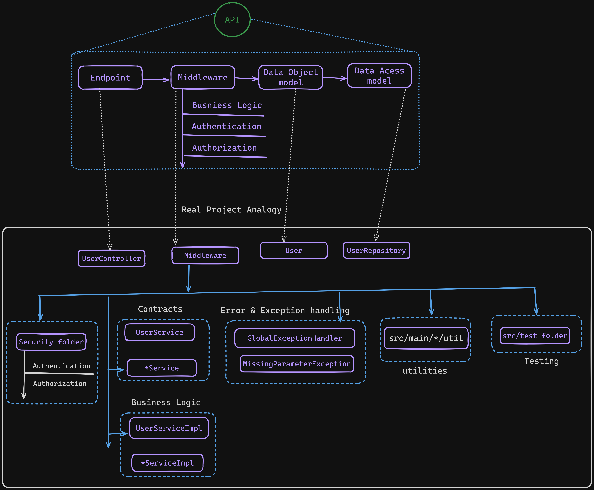

# Developing a User Management API with Spring Boot

In this tutorial, we will walk through the process of developing a User Management API using Spring Boot, following best practices in API design. This API will support CRUD operations for users and include authentication and password management features.

NOTE: For reference, please visit the following GitHub repository: https://github.com/VishalPawar1010/SpringBoot_Angular_FullStackWebApp

## 1. Define Goals/Intention: Understanding the API Requirements

Before we start coding, it's essential to define the requirements of our API.

### 1. API Purpose

The User Management API is designed to facilitate the management of user accounts within an application. It allows for the creation, retrieval, updating, and deletion of user information, as well as handling user authentication and password management.

- **User CRUD Operations**: Create, Read, Update, and Delete user accounts.
- **User Authentication**: Login and logout functionality.
- **Password Management**: Features for password reset and verification.
- **Image Management**: Upload and view user profile images.
- **Data Export**: Export user data in CSV, Excel, and PDF formats.

NOTE: This tutorial will focus exclusively on CRUD operations. For additional functionalities, please refer to the classes in the repository.

### 2. User Roles

The API will cater to different user roles, including:

- **Administrators**: Have full access to manage user accounts, including creating, updating, and deleting users.
- **Regular Users**: Can manage their own accounts, including updating personal information and changing passwords.

### 3. Information Flow

The API will handle the following types of data:

- **User Data**: Information such as email, password, first name, last name, and profile images.
- **Authentication Tokens**: JWT or similar tokens for user authentication.

### 4. Security Improvements

To ensure the security of the API, the following measures will be implemented:

- **Authentication**: Use JWT for secure user authentication.
- **Authorization**: Implement role-based access control to restrict access to certain endpoints based on user roles.
- **Input Validation**: Validate all incoming data to prevent SQL injection and other attacks.

### 5. Error and Exception Handling: [refer this folder](https://github.com/VishalPawar1010/SpringBoot_Angular_FullStackWebApp/tree/develop/UmsApp/spring-boot-App/src/main/java/com/growth10Mindset/admin/exceptions)

The API will provide standardized error responses to ensure that clients can handle errors gracefully. Key aspects of error handling include:

- **HTTP Status Codes**: Use appropriate HTTP status codes to indicate the result of API requests (e.g., 400 for bad requests, 404 for not found, 500 for server errors).
- **Custom Exception Classes**: Implement custom exception classes to handle specific error scenarios, such as `UserNotFoundException` for cases where a user is not found.
- **Global Exception Handler**: Use a global exception handler (e.g., with `@ControllerAdvice`) to catch exceptions thrown by the API and return standardized error responses.
- **Error Response Format**: Define a consistent error response format that includes fields such as `status`, `error`, `message`, and `timestamp` to provide clear information about the error.

## 2. Select Technology Stack

In this project, we utilized a robust technology stack to ensure the development of a scalable and efficient User Management API. The primary technologies used are:

- **Java**: A widely-used programming language known for its portability, performance, and extensive ecosystem. Java is the backbone of our application, providing a strong foundation for building enterprise-level applications.

- **Spring Boot**: A powerful framework that simplifies the development of Java applications. It allows for rapid application development with minimal configuration. Spring Boot provides built-in features such as dependency injection, security, and data access, making it an ideal choice for building RESTful APIs. For more details, you can explore the Spring Boot implementation in our project [here](https://github.com/VishalPawar1010/SpringBoot_Angular_FullStackWebApp/tree/develop/UmsApp/spring-boot-App).

- **MySQL**: A popular relational database management system that is known for its reliability and ease of use. MySQL is used to store user data and manage relationships between different entities in our application.

In addition to the primary stack, we also developed a demo API using **Node.js** and **MongoDB**. This alternative stack showcases the flexibility of our approach and allows for different use cases. You can find the Node.js and MongoDB implementation [here](https://github.com/VishalPawar1010/SpringBoot_Angular_FullStackWebApp/tree/develop/UmsApp/nodeJS-backend-app).

This combination of technologies ensures that our User Management API is not only efficient but also scalable and maintainable, catering to various user needs and future enhancements.

NOTE: In the document [API_Design](/API/Api_Design.md), Steps 3, 4, and 5 in the section on Stages of API Design can be considered interchangeable according design analysis.

### 1. Setting Up the Project

We will use Spring Boot to create our API. Ensure you have the following dependencies in your `pom.xml`([`pom.xml`](https://github.com/VishalPawar1010/SpringBoot_Angular_FullStackWebApp/blob/develop/UmsApp/spring-boot-App/pom.xml)):



## 3. Designing the API Endpoints

Following the **Outside-In** approach, we will design our API endpoints based on user needs. The some of endpoints for our User Management API are as follows:

- `GET /api/users`: Retrieve all users.
- `GET /api/users/{id}`: Retrieve a user by ID.
- `POST /api/users`: Create a new user.
- `PUT /api/users/{id}`: Update an existing user.
- `DELETE /api/users/{id}`: Delete a user by ID.

## 4. Plan the data model and contracts

Below is a structured explanation of the data model and contracts based on the provided [User.java](https://github.com/VishalPawar1010/SpringBoot_Angular_FullStackWebApp/blob/develop/UmsApp/spring-boot-App/src/main/java/com/growth10Mindset/admin/entity/User.java) and [UserService.java](https://github.com/VishalPawar1010/SpringBoot_Angular_FullStackWebApp/blob/develop/UmsApp/spring-boot-App/src/main/java/com/growth10Mindset/admin/service/UserService.java) file

### 1. Data Model

The data model for the User Management API is represented by the `User` entity class. This class defines the structure of the user data that will be stored in the database. We have added validations to prevent incorrect data from being stored in the database. Below are the key attributes and their annotations:

### User Entity

```java

@Entity
@Table(name = "users")
public class User {
    @Id
    @GeneratedValue(strategy = GenerationType.IDENTITY)
    private Integer id;

    @Column(length = 128, nullable = false, unique = true)
    @NotEmpty(message = "Email is required")
    @NotNull(message = "Email should not be null")
    @Email(message = "Invalid email format")
    private String email;

    @Column(length = 64, nullable = false)
    @NotBlank(message = "Password is required")
    @Pattern(regexp = "^(?=.*[A-Za-z])(?=.*\\d)(?=.*[@$!%*#?&])[A-Za-z\\d@$!%*#?&]{8,}$",
            message = "Password must contain at least one alphabetical character, one digit, one special character, and be at least 8 characters long.")
    private String password;

    @Column(name = "first_name", length = 45, nullable = false)
    @Size(min = 2, message = "First Name must be at least 2 characters long")
    @NotBlank(message = "First Name is required")
    @Pattern(regexp = "^[A-Z][a-zA-Z]*$", message = "First Name should start with a capital letter and contain only alphabets.")
    private String firstName;

    @Column(name = "last_name", length = 45, nullable = false)
    @Size(min = 2, message = "Length must be greater than 1")
    @NotBlank(message = "Last Name is required")
    @Pattern(regexp = "^[A-Z][a-zA-Z]*$", message = "Last Name should start with a capital letter and contain only alphabets.")
    private String lastName;

    @Column(name = "gender", length = 45, nullable = false)
    @NotBlank(message = "Gender is required")
    private String gender;

    private boolean enabled;

    // Other required fields

    // Getters and Setters
}
```

### Key Attributes

- **id**: Unique identifier for the user (Primary Key).
- **email**: User's email address (must be unique and valid).
- **password**: User's password (must meet complexity requirements).
- **firstName**: User's first name (must start with a capital letter).
- **lastName**: User's last name (must start with a capital letter).
- **gender**: User's gender.
- **enabled**: Indicates whether the user account is active.

### 2. Contracts

The contracts for the User Management API are defined in the `UserService` interface. This interface outlines the operations that can be performed on the `User` entity.

### UserService Interface

```java

public interface UserService {
    List<User> getAllUsers();
    User getUserById(Integer id);
    User findByEmail(String email);
    User addUser(User newUser);
    User updateUserById(Integer id, User updatedUser);
    void deleteUserById(Integer id);

   // other methods
}
```

#### Key Methods

- **getAllUsers()**: Retrieves a list of all users.
- **getUserById(Integer id)**: Retrieves a user by their unique ID.
- **findByEmail(String email)**: Finds a user by their email address.
- **addUser(User newUser)**: Adds a new user to the system.
- **updateUserById(Integer id, User updatedUser)**: Updates an existing user's information.
- **deleteUserById(Integer id)**: Deletes a user by their unique ID.

## 5. Design Data Access Layer and Business Logic

Below is an explanation of the Data Access Layer and Business Logic Layer for the User Management API, based on the provided code snippets for [UserRepository.java](https://github.com/VishalPawar1010/SpringBoot_Angular_FullStackWebApp/blob/develop/UmsApp/spring-boot-App/src/main/java/com/growth10Mindset/admin/repo/UserRepository.java) and [UserServiceImpl.java](https://github.com/VishalPawar1010/SpringBoot_Angular_FullStackWebApp/blob/develop/UmsApp/spring-boot-App/src/main/java/com/growth10Mindset/admin/service/UserServiceImpl.java).

### 1. Data Access Layer

The Data Access Layer (DAL) is responsible for interacting with the database. In this API, the `UserRepository` interface serves as the DAL. It extends the `JpaRepository` interface provided by Spring Data JPA, which simplifies data access and manipulation.

### UserRepository Interface

```java


@Repository
@CrossOrigin("http://localhost:4200")
public interface UserRepository extends JpaRepository<User, Integer> {

    Optional<User> findByEmail(String email);

    boolean existsByEmail(String email);

    Optional<User> findByResetPasswordToken(String token);
}
```

### Key Features of UserRepository

- **Inheritance from JpaRepository**: By extending `JpaRepository`, `UserRepository` inherits several methods for CRUD operations, such as `save()`, `findAll()`, `findById()`, and `delete()`, which allows for easy interaction with the database without needing to implement these methods manually.

- **Custom Query Methods**: The repository defines custom query methods:

  - `findByEmail(String email)`: Retrieves a user by their email address.
  - `existsByEmail(String email)`: Checks if a user exists with the given email.
  - `findByResetPasswordToken(String token)`: Finds a user by their reset password token.

- **Optional Return Types**: The use of `Optional<User>` allows for safe handling of cases where a user may not be found, reducing the risk of `NullPointerExceptions`.

## 2. Business Logic Layer

The Business Logic Layer (BLL) contains the core functionality of the application. In this API, the `UserServiceImpl` class implements the `UserService` interface and contains the business logic related to user management.

### UserServiceImpl Class

```java

@Service
public class UserServiceImpl implements UserService {
    private final UserRepository userRepository;
    private final String defaultPassword = "abcd";


    @Override
    public List<User> getAllUsers() {
        List<User> users = userRepository.findAll();
        for (User user : users) {
            byte[] photos = user.getPhotos();
            if (photos != null) {
                byte[] decompressedData = ImageUtil.decompressImage(photos);
                user.setPhotos(decompressedData);
            }
        }
        return users;
    }

    @Override
    public User getUserById(Integer id) {
        Optional<User> userOptional = userRepository.findById(id);
        return userOptional.orElse(null);
    }

    @Override
    public User findByEmail(String email) {
        return userRepository.findByEmail(email).get();
    }


    @Override
    public User addUser(User newUser) {
        if (newUser.getPassword() != null) {
            newUser.setPassword(encode(newUser.getPassword()));
        } else {
            newUser.setPassword(encode(defaultPassword));
        }
        return userRepository.save(newUser);
    }

    @Override
    public User updateUserById(Integer id, User updatedUser) {
        Optional<User> userOptional = userRepository.findById(id);
        if (userOptional.isPresent()) {
            User user = userOptional.get();
            user.setEmail(updatedUser.getEmail());
            user.setFirstName(updatedUser.getFirstName());
            user.setLastName(updatedUser.getLastName());
            user.setGender(updatedUser.getGender());
            user.setEnabled(updatedUser.isEnabled());
            user.setRoles(updatedUser.getRoles());
            return userRepository.save(user);
        } else {
            return null;
        }
    }

    @Override
    public void deleteUserById(Integer id) {
        Optional<User> userOptional = userRepository.findById(id);
        if (userOptional.isPresent()) {
            userRepository.delete(userOptional.get());
        }
    }

  // other methods

}
```

### Key Features of UserServiceImpl

- **Business Logic Implementation**: The `UserServiceImpl` class contains the core business logic for user management, including methods for adding, updating, deleting, and retrieving users.

- **Password Management**: The service handles password encoding using `BCryptPasswordEncoder`, ensuring that passwords are stored securely.

- **Image Management**: The service includes methods for updating and viewing user profile images, utilizing the `ImageUtil` class for image compression and decompression.

- **Email Notifications**: The service can send emails to users, such as for password resets, using the `JavaMailSender`.

- **Error Handling**: The service throws exceptions when a user is not found, providing clear feedback for error handling in the application.

The Data Access Layer (`UserRepository`) and Business Logic Layer (`UserServiceImpl`) work together to provide a robust and maintainable structure for the User Management API. The repository handles all interactions with the database, while the service implements the business rules and logic necessary for managing user data effectively.

## 6. Create Endpoints: Implementing the UserController

Now, let's implement the [UserController](https://github.com/VishalPawar1010/SpringBoot_Angular_FullStackWebApp/blob/develop/UmsApp/spring-boot-App/src/main/java/com/growth10Mindset/admin/controller/UserController.java) class, which will handle the API requests. Below is the complete implementation:

```java

@RestController
@RequestMapping("/api/users")
@CrossOrigin("http://localhost:4200")
public class UserController {

    private final UserService userService;

    @Autowired
    public UserController(UserService userService) {
        this.userService = userService;
    }

    @GetMapping("")
    public ResponseEntity<List<User>> getAllUsers() {
        List<User> users = userService.getAllUsers();
        return ResponseEntity.ok(users);
    }

    @GetMapping("/{id}")
    public ResponseEntity<User> getUserById(@PathVariable Integer id) {
        User user = userService.getUserById(id);
        if (user != null) {
            return ResponseEntity.ok(user);
        } else {
            return ResponseEntity.notFound().build();
        }
    }

    @PostMapping("")
    public ResponseEntity<User> addUser(@Valid @RequestBody User newUser) {
        User createdUser = userService.addUser(newUser);
        return ResponseEntity.status(HttpStatus.CREATED).body(createdUser);
    }

    @PutMapping("/{id}")
    public ResponseEntity<User> updateUserById(@PathVariable Integer id, @RequestBody User updatedUser) {
        User savedUser = userService.updateUserById(id, updatedUser);
        if (savedUser != null) {
            return ResponseEntity.ok(savedUser);
        } else {
            return ResponseEntity.notFound().build();
        }
    }

    @DeleteMapping("/{id}")
    public ResponseEntity<Void> deleteUserById(@PathVariable Integer id) {
        userService.deleteUserById(id);
        return ResponseEntity.noContent().build();
    }

}
```

## 7. Testing the API

Once the implementation is complete, it's crucial to test the API endpoints to ensure they work as expected. You can use tools like Postman or curl to send requests to your API and verify the responses.

### Example Test Cases

The following test cases demonstrate how to test the `UserController` methods using JUnit and Mockito in test classes such as [UserControllerTests](https://github.com/VishalPawar1010/SpringBoot_Angular_FullStackWebApp/blob/develop/UmsApp/spring-boot-App/src/test/java/com/growth10Mindset/admin/controller/UserControllerTests.java) :

```java

public class UserControllerTests {

    @Mock
    private UserService userService;

    @InjectMocks
    private UserController userController;

    @BeforeEach
    public void setUp() {
        MockitoAnnotations.openMocks(this);
    }

    @Test
    public void testGetAllUsers() {
        List<User> users = new ArrayList<>();
        users.add(new User(1, "user1@example.com", "password1", "John", "Doe", "male", false, null));
        users.add(new User(2, "user2@example.com", "password2", "Jane", "Smith", "male", false, null));

        when(userService.getAllUsers()).thenReturn(users);

        ResponseEntity<List<User>> response = userController.getAllUsers();

        assertEquals(HttpStatus.OK, response.getStatusCode());
        assertEquals(users, response.getBody());
        verify(userService, times(1)).getAllUsers();
    }

    @Test
    public void testGetUserById_ExistingId() {
        User user = new User(1, "user1@example.com", "password1", "John", "Doe", "male", false, null);

        when(userService.getUserById(1)).thenReturn(user);

        ResponseEntity<User> response = userController.getUserById(1);

        assertEquals(HttpStatus.OK, response.getStatusCode());
        assertEquals(user, response.getBody());
        verify(userService, times(1)).getUserById(1);
    }

    @Test
    public void testGetUserById_NonExistingId() {
        when(userService.getUserById(1)).thenReturn(null);

        ResponseEntity<User> response = userController.getUserById(1);

        assertEquals(HttpStatus.NOT_FOUND, response.getStatusCode());
        assertNull(response.getBody());
        verify(userService, times(1)).getUserById(1);
    }

    // Additional tests for other methods...
}
```

These tests cover the basic functionality of the `UserController`, ensuring that the API behaves as expected when interacting with the `UserService`. You can add more tests for other methods in the controller to ensure comprehensive coverage.

## 8. Security Overview: [refer this folder](https://github.com/VishalPawar1010/SpringBoot_Angular_FullStackWebApp/tree/develop/UmsApp/spring-boot-App/src/main/java/com/growth10Mindset/admin/security)

The security of the User Management API is a critical aspect of its design. The following components contribute to the overall security framework:

- **JWT Authentication**: The API uses JSON Web Tokens (JWT) for secure authentication. When a user logs in, a token is generated and sent back to the client. This token must be included in the header of subsequent requests to access protected resources.

- **Role-Based Access Control**: The API implements role-based access control (RBAC) to restrict access to certain endpoints based on user roles. This ensures that only authorized users can perform specific actions, such as creating or deleting user accounts.

- **Input Validation**: All incoming data is validated to prevent common security vulnerabilities, such as SQL injection and cross-site scripting (XSS). The use of annotations like `@NotEmpty`, `@Email`, and `@Pattern` in the `User` entity class helps enforce these validations.

- **Global Exception Handling**: The `GlobalExceptionHandler` class is used to manage exceptions throughout the API. This ensures that any security-related exceptions, such as expired JWT tokens, are handled gracefully and provide meaningful feedback to the client.

- **Email Verification**: The API includes functionality for sending verification emails, which can be used to confirm user accounts and enhance security.

## Conclusion

In this tutorial, we have developed a User Management API using Spring Boot, adhering to best practices in API design. By following the API-first approach, we ensured that our API is user-centric, scalable, and maintainable. This API can serve as a foundation for more complex applications and can be extended with additional features as needed.
