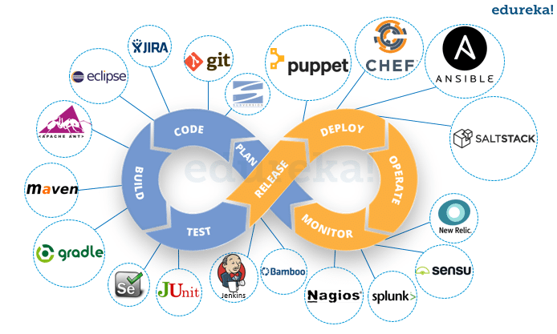
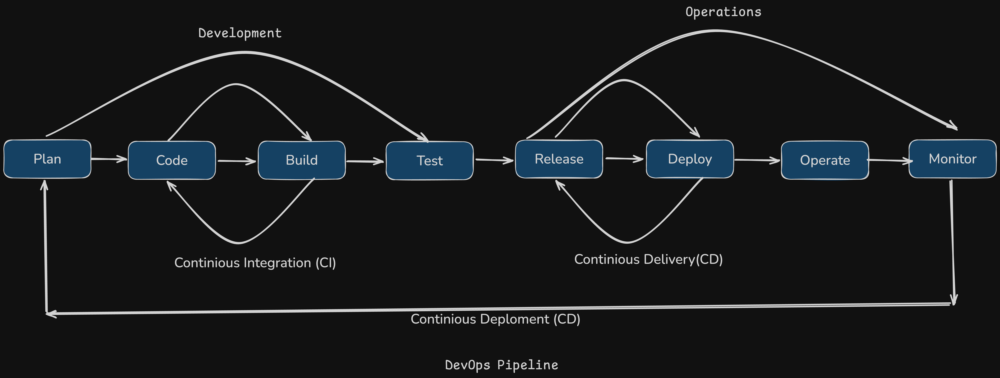

# DevOps Pipeline Design

## Overview

This document presents an enhanced DevOps solution integrated into the Software Development Life Cycle (SDLC). The solution encompasses a deep understanding of DevOps' necessity, a strategic selection of technologies and services, detailed stakeholder considerations, trade-offs analysis, and an end-to-end system explanation complemented by a visual sketch.

## 1. Need/Background of DevOps in SDLC

### Understanding the Problem

The **Software Development Life Cycle (SDLC)** involves multiple stages: planning, development, testing, deployment, and maintenance. Traditionally, these phases were handled by separate teams, leading to several inefficiencies:

- **Siloed Teams:** Development (Dev) and Operations (Ops) teams work in isolation, causing communication gaps and misaligned goals.
- **Delayed Deployments:** Handoffs between teams result in extended release cycles and slower time-to-market.
- **Inconsistent Environments:** Discrepancies between development, testing, and production environments lead to unexpected bugs and deployment issues.
- **Limited Feedback Loops:** Inefficient feedback mechanisms hinder prompt issue resolution and continuous improvement.

### Why DevOps is Essential

**DevOps** emerges as a solution to these challenges by fostering a culture of collaboration, automation, and continuous improvement. It bridges the gap between Dev and Ops, ensuring seamless integration and efficient workflow throughout the SDLC. This integration enhances:

- **Speed:** Accelerates release cycles through automation and continuous integration.
- **Quality:** Improves software quality via automated testing and continuous feedback.
- **Reliability:** Ensures consistent deployments and scalable infrastructure.
- **Collaboration:** Promotes shared responsibilities and unified objectives among teams.

---

## 2. Components of DevOps: Development and Operations

### Development (Dev)

**Dev** focuses on creating and enhancing software applications. Key components include:

- **Coding & Programming:** Utilizing languages and frameworks like Python, Java, or Node.js.
- **Version Control:** Implementing Git repositories (e.g., GitHub, GitLab) for code management.
- **Continuous Integration (CI):** Employing tools like Jenkins or CircleCI to automate builds and tests.
- **Feature Development:** Leveraging Agile methodologies to develop new functionalities iteratively.

### Operations (Ops)

**Ops** ensures the smooth deployment and maintenance of applications. Key components include:

- **Infrastructure Management:** Utilizing Infrastructure as Code (IaC) tools like Terraform or Ansible.
- **Deployment Automation:** Using containerization (Docker) and orchestration (Kubernetes) for streamlined deployments.
- **Monitoring & Logging:** Implementing tools like Prometheus, Grafana, and ELK Stack for real-time monitoring.
- **Security & Compliance:** Ensuring adherence to security protocols and regulatory standards using tools like HashiCorp Vault.

---

## 3. Strategic Selection of Technology Stack and Services

### Technology Stack

- **Programming Languages:** Python and JavaScript for backend and frontend development.
- **Frameworks:** Django for backend, React for frontend.
- **Version Control:** Git with GitHub for repository management.
- **CI/CD Tools:** Jenkins for continuous integration, Docker for containerization, Kubernetes for orchestration.
- **Cloud Services:** AWS for scalable infrastructure, utilizing services like EC2, S3, RDS, and Lambda.
- **Monitoring Tools:** Prometheus for metrics collection, Grafana for visualization, ELK Stack for logging.

### Justification

- **Scalability:** AWS offers scalable infrastructure, ensuring the system can handle increasing loads.
- **Flexibility:** Docker and Kubernetes provide flexibility in deployment and management of containerized applications.
- **Automation:** Jenkins automates the CI/CD pipeline, reducing manual interventions and accelerating deployments.
- **Reliability:** Terraform ensures consistent infrastructure provisioning, minimizing discrepancies across environments.
- **Visibility:** Prometheus and Grafana offer comprehensive monitoring, enabling proactive issue resolution.

---

## 4. Important Concepts for project planning and management

### Key Elements Integrated

- **Objectives:** Enhance deployment speed, improve software quality, ensure system reliability.
- **Stakeholders:** Development teams, Operations teams, QA engineers, end-users, project managers.
- **Resources:** Cloud infrastructure (AWS), CI/CD tools (Jenkins), containerization (Docker), monitoring tools (Prometheus, Grafana).
- **Constraints:** Budget limitations, existing legacy systems, team expertise.

### Design Patterns and Heuristics

- **Microservices Architecture:** Facilitates independent deployment and scalability of services.
- **Infrastructure as Code (IaC):** Ensures reproducible and version-controlled infrastructure provisioning.
- **Continuous Feedback Loops:** Implements real-time monitoring and feedback to drive continuous improvement.
- **Automated Testing:** Integrates unit, integration, and system tests within the CI pipeline to maintain high quality.

---

## 5. Trade-offs Consideration

### Space vs. Cost

- **Containerization:** While Docker images consume storage space, they reduce deployment inconsistencies and operational costs by enabling efficient resource utilization.

### Time vs. Quality

- **Automated Testing:** Investing time in comprehensive automated tests enhances software quality but may extend initial setup time.

### Scalability vs. Complexity

- **Kubernetes Orchestration:** Offers robust scalability but introduces complexity in cluster management, requiring skilled personnel.

### Cost vs. Performance

- **Cloud Services Optimization:** Balancing the use of high-performance instances with cost-effective alternatives to optimize expenditure without compromising performance.

### Service Provider Selection vs. Custom Pipeline

- **Consideration**: Choosing between major cloud service providers like Amazon Web
  Services (AWS), Microsoft Azure, and Google Cloud Platform (GCP), or using a
  combination of DevOps tools to build a custom pipeline.
- **Solution**: Evaluate the specific requirements and constraints of the project to
  determine whether leveraging the integrated services of a major provider for
  simplicity and support, or creating a tailored solution with specialized tools for
  greater flexibility and potential cost savings.

## 3. Detailed Pipeline Stages

1. **Plan**:
   - **Requirement Assessment and Finalization**: Collaborate with stakeholders to gather
     and finalize project requirements, ensuring that all necessary features and constraints
     are clearly defined and understood.
   - **Timeline Estimation and Finalization**: Estimate the timeline for each phase of the
     pipeline design and finalize deadlines to ensure timely delivery and efficient resource
     allocation.
   - **Task Assignment**: Assign specific tasks to team members based on their expertise
     and roles, facilitating a structured and organized approach to pipeline development
2. **Source Code Management**:

   - **Action**: Developers write and commit code to a Git repository.
   - **Tools**: Git platforms like GitHub, GitLab, or Bitbucket; integrated development
     environments (IDEs) such as VS Code and IntelliJ; and local development environments
     for efficient coding and testing.
   - **Best Practices**: Implement branching strategies (e.g., Gitflow) and enforce code
     reviews to maintain code quality and facilitate collaboration.

3. **Continuous Integration (CI)**:

   - **Build**:
     - **Action**: Jenkins automatically triggers a build process upon code commits.
     - **Details**: The build stage compiles the code, resolves dependencies, and packages
       the application, ensuring that the codebase remains in a deployable state.
   - **Test**:
     - **Action**: Automated tests are executed to verify code quality and functionality.
     - **Tools**: Unit tests, integration tests, and static code analysis tools.
     - **Best Practices**: Incorporate a comprehensive test suite to catch issues early
       and maintain high code quality standards.

4. **Continuous Deployment (CD)**:

   - **Staging Environment**:
     - **Action**: Deploy the built application to a staging environment that mirrors
       production.
     - **Purpose**: Conduct further testing, including user acceptance testing (UAT) and
       performance testing, to validate the application's readiness for production.
   - **Approval**:
     - **Action**: Implement a manual or automated approval process before deploying to
       production.
     - **Details**: This step ensures that all tests have passed and that stakeholders
       have reviewed the changes, adding an additional layer of quality control.

5. **Production Deployment**:
   - **Action**: Deploy the application to the production environment using strategies
     like blue-green or canary deployments.
   - **Blue-Green Deployment**: Involves running two identical production environments
     (blue and green) and switching traffic from one to the other, minimizing downtime and
     risks.
   - **Canary Deployment**: Gradually rolls out changes to a small subset of users before
     a full-scale release, allowing for monitoring and rollback if issues arise.
6. **Monitoring and Feedback**:
   - **Action**: Continuously monitor application performance and gather user feedback.
   - **Tools**: Prometheus for metrics, Grafana for visualization, and ELK stack for log
     analysis.
   - **Purpose**: Identify and resolve issues proactively, gather insights for
     improvement, and ensure the application meets user expectations.
     A DevOps pipeline typically consists of several interconnected stages, each contributing to the seamless delivery of software from development to production:

## 6. End-to-End System Explanation

### User Journey

1. **Development Phase:**

   - Developers write code using preferred languages and frameworks.
   - Code is committed to a GitHub repository, triggering the CI pipeline in Jenkins.

2. **Continuous Integration:**

   - Jenkins automatically builds the application and runs automated tests.
   - Upon successful tests, Docker images are created and pushed to AWS Elastic Container Registry (ECR).

3. **Deployment Phase:**

   - Kubernetes orchestrates the deployment of Docker containers to AWS Elastic Kubernetes Service (EKS).
   - Infrastructure changes are managed via Terraform scripts, ensuring consistency across environments.

4. **Monitoring and Feedback:**

   - Prometheus collects metrics, while Grafana visualizes system performance.
   - The ELK Stack aggregates logs, providing insights into application behavior.
   - Real-time alerts are sent to relevant teams for prompt issue resolution.

5. **Maintenance and Scaling:**
   - Based on monitoring data, the system auto-scales using Kubernetes to handle varying loads.
   - Regular updates and patches are deployed through the CI/CD pipeline, maintaining system reliability.

## 8. Conclusion

By integrating **DevOps** into the **SDLC**, organizations can achieve a harmonious balance between development speed and operational reliability. The strategic selection of technologies, adherence to best practices, and meticulous consideration of trade-offs ensure a robust, scalable, and efficient system. This comprehensive approach not only addresses existing challenges but also positions the organization for continuous growth and innovation.
